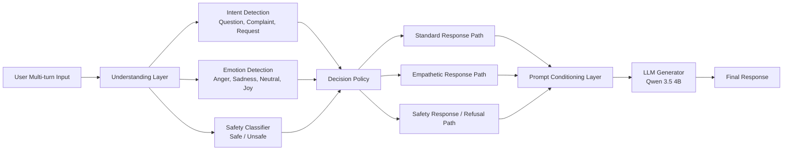

# Emotionaware-API-for-LLMs

Emotionaware-API-for-LLMs is a production-style API layer for LLMs that enhances responses using emotion awareness, intent detection, safety filtering, and a policy-driven decision engine. It dynamically routes user queries based on emotional and contextual signals to generate empathetic, safe, and contextually appropriate responses without modifying the underlying model.

The system uses a modular architecture consisting of an understanding layer (intent, emotion, safety models), a core decision policy engine that determines response strategy, and an action router that executes LLM calls, safety refusals, or optional retrieval-augmented generation (RAG). A feedback loop collects user ratings and interaction signals to improve future decision-making.

## System Architecture

