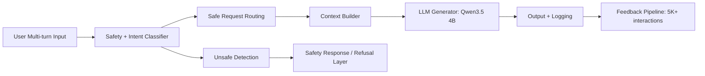

# Emotionaware-API-for-LLMs

This project builds an API layer for LLMs that improves responses by adding emotion awareness, intent detection, safety handling, and user feedback learning. It generates more empathetic, safe, and context-aware responses without modifying the base model. The system first analyzes user input to detect emotion and intent (question, rant, help-seeking). Based on this, it dynamically routes and conditions prompts to guide the LLM toward appropriate responses (empathetic tone, safe refusal). A built-in feedback loop collects user ratings and converts them into training data to improve the model. 

## System Architecture

